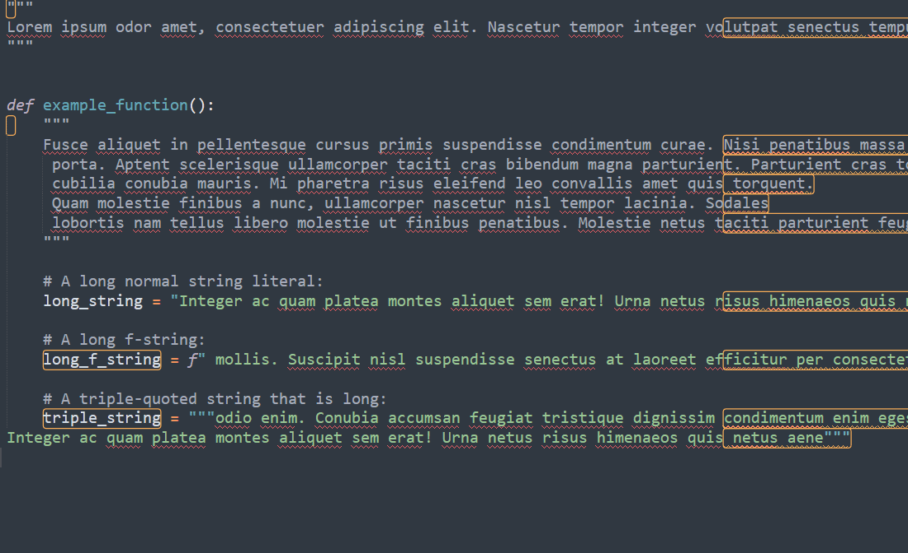

# AutoWrapStrings

**AutoWrapStrings** is a Sublime Text package that automatically wraps long Python string literals to fit within a specified maximum line length. The plugin processes both single/double-quoted strings and triple‑quoted strings, adjusting the content to avoid exceeding the defined column width.



> [!WARNING]  
> While **AutoWrapStrings** aims to reformat Python string literals accurately, it may contain edge cases where the wrapping does not behave as expected. Use with caution and consider reviewing changes after applying auto wrap.

## Installation

You only need to place the packages files in a folder named `AutoWrapStrings` in your Sublime Text Packages directory.

## Usage

- **Manual Wrapping:**  
  Open the Command Palette (via `Ctrl+Shift+P` or `Cmd+Shift+P` on macOS) and run the command **AutoWrap: Apply Auto Wrap to File** to manually trigger auto wrapping.

- **Auto-Wrap on Save:**  
  When you save a Python file, if the setting `apply_on_save` is enabled (default is disabled), the plugin will automatically reformat string literals to ensure no line exceeds the `max-line-length` (default is 79).

- **Configurable Settings:**  
  Customize the maximum line length and enable or disable auto-wrapping on save through the settings available in ``Preferences/Package Settings\AutoWrapStrings\Settings`.

## Note

**AutoWrapStrings** has been made completely for **Python script**. 

For a more general plugin that wrapped lines you can use [Wrap Plus](https://packagecontrol.io/packages/Wrap%20Plus). It might works better for general purposes, but in a python context **AutoWrapStrings** might be more appropriate, for example:

```python
    long_f_string = f" mollis. Suscipit nisl suspendisse senectus at laoreet efficitur per consectetur. Posuere potenti sollicitudin metus dictum dictum neque magnis. Accumsan, {long_string}! "
```

is wrapped like this with ``WrapPlus``:

```python
    long_f_string = f" mollis. Suscipit nisl suspendisse senectus at laoreet
    efficitur per consectetur. Posuere potenti sollicitudin metus dictum
    dictum neque magnis. Accumsan, {long_string}! "
```

Which break the python code. While ``AutoWrapStrings`` does it like that:

```python
    long_f_string = f" mollis. Suscipit nisl suspendisse senectus at laoreet"
    f"efficitur per consectetur. Posuere potenti sollicitudin metus dictum"
    f"dictum neque magnis. Accumsan, {long_string}!"
```
Trying to not break the code.